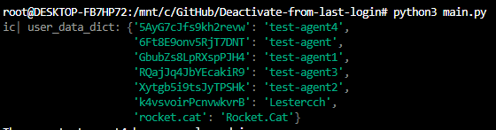
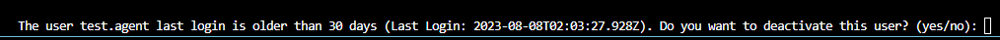
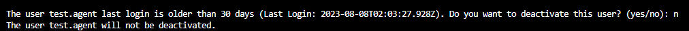
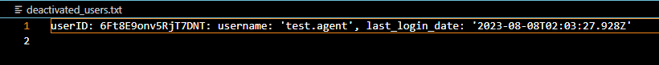
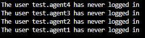
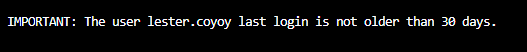

# Deactivate-from-last-login
 Script to deactivate a user based on their last login parameter for Rocket.Chat

The script can be used up to 5,000 users.

The way it works is:

-> Get the list of users in the Workspace.

-> Verifies each user's info and get the params: `username` & `userId`.

-> Using the `userId` param, it gets the `last_login` info from each user.

-> If the info is less than certain amount of days, it can deactivate the user. It always ask before to proceed if you would like to deactivate this user.

-> It can also be used to Activate some users, changing some params for it.

**Steps to run it**

1. Run the main.py file:

2. If you remove the comment for the param: `# ic(user_data_dict)` in the users_list.py file, it will show you first the info in the dictionary:

you can remove it if required.

3. In case there's one user who hasn't logged in more than 30 days ago (you can change this param), it will throw an input asking to know if you would like to proceed with the request, and showing the last date the user accessed to the workspace. If pressing `Yes`, `YES`, 'Y' or 'y', it will proceed:

If pressing yes, it will deactivate user, otherwise, it won't:

![Alt text]images/(image-4.png)

4. It will display a list of users and it will be saved into a file called "deactivated_users.txt" located in "deactivated_users_lists" folder for every time it happens:

5. In case the user is not already activated or hasn't logged in beyond 30 days, it will throw a notice:

Hope it helps :rocket: